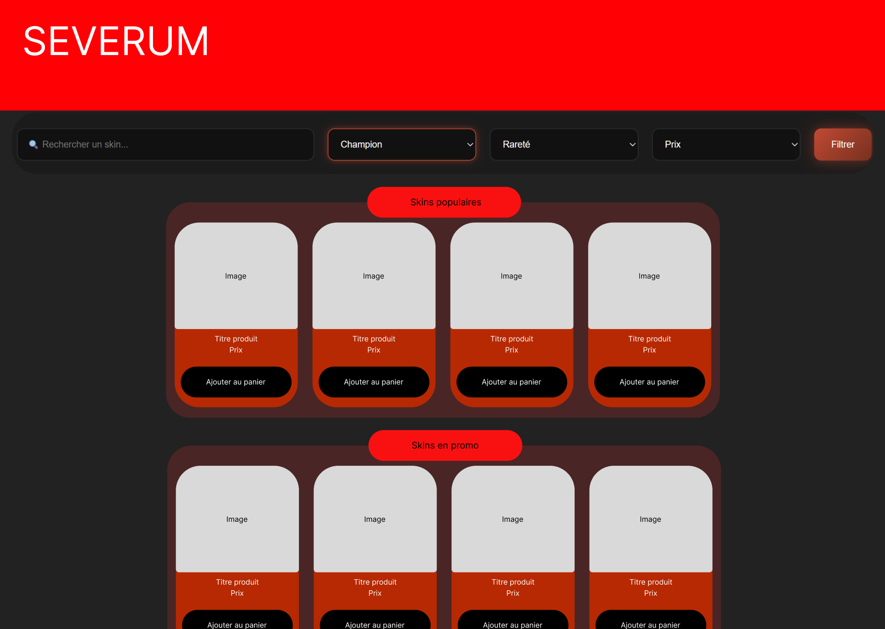
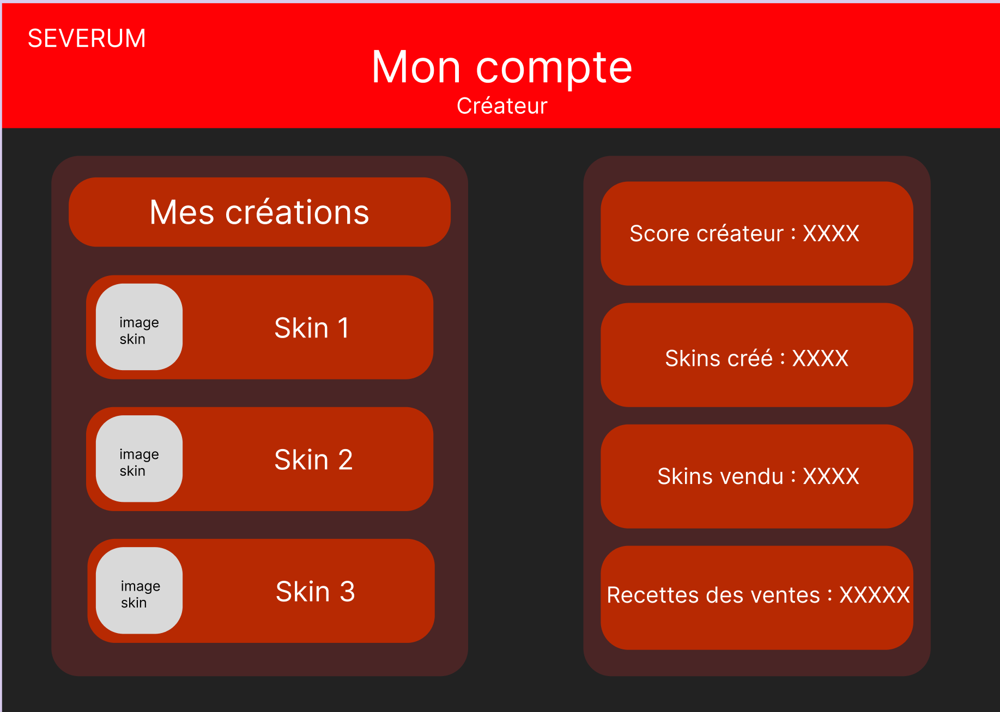
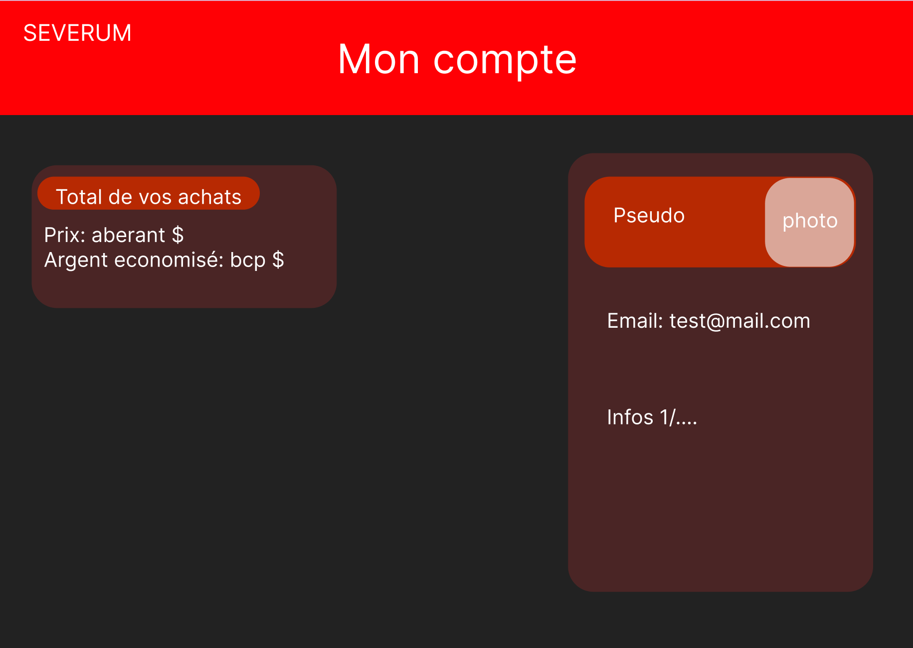
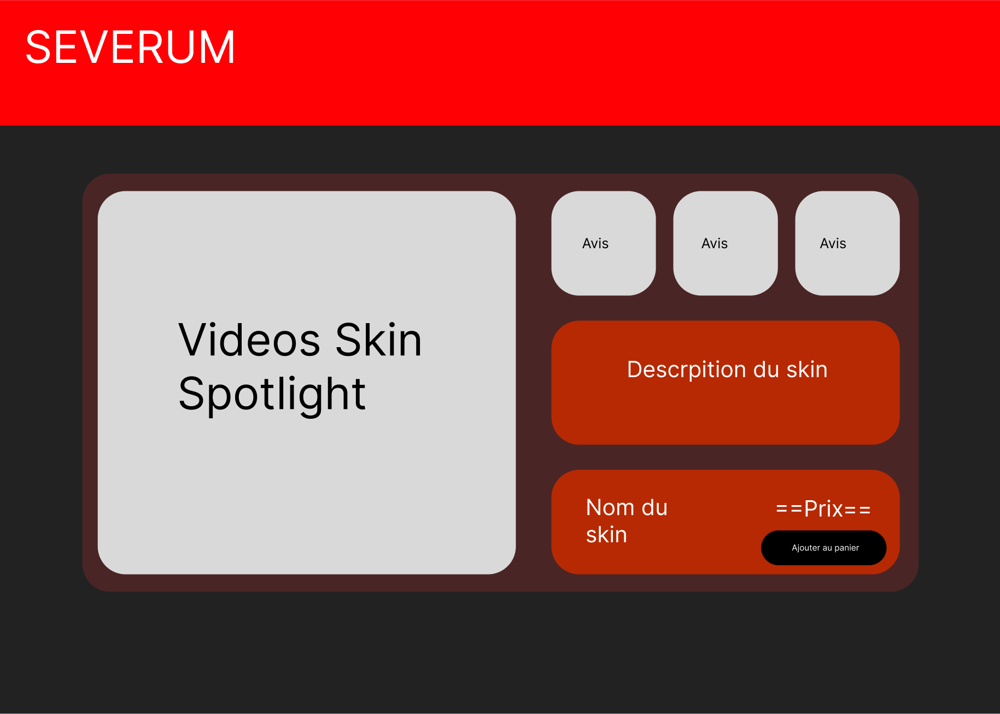
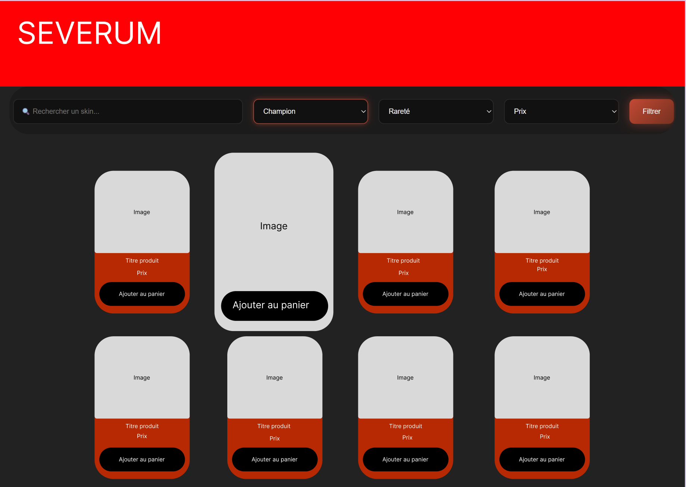
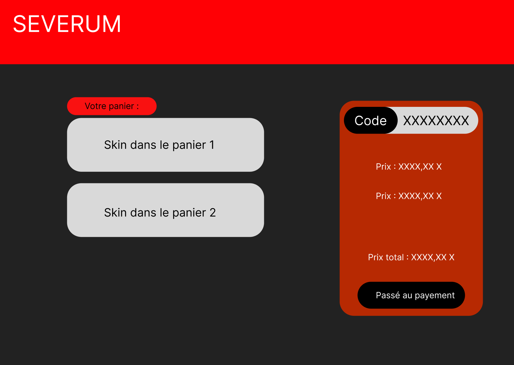

# Site de ventes de skins customs League of Legends

## Maquette du site : 

Une marketplace pour les particuliers qui souhaitent vendre leur création, le site inclue une description des vendeurs (sous forme de profil vendeur),
de leurs produits, un guide d'installation pour l'application qui permet de faire marcher les skins, et la possibilité de devenir
vendeur à son tour.

## Maquette UI : 

### Homepage :

### Profil vendeur :

### Profil acheteur :

### Detail produit :

### Homepage bis:

### Panier :

## Frameworks : 

- Symfony
- React.js + Vite
- PostGre